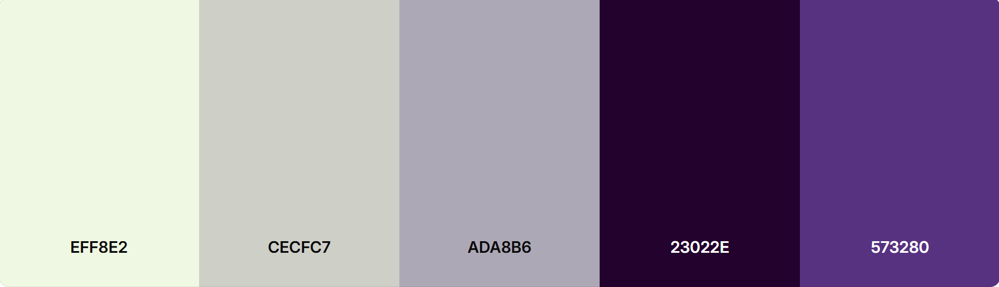

# Documentation of Random User Generator

Sofia Ressia - Classe 4BINF, IIS G.Vallauri

## First page

La prima pagina visualizzata è la pagina principale nominata `firstPage.html` a cui sono linkati un css e un js.
La pagina presenta un titolo principale con alcune animazioni per rendelo più interattivo e un click su l'intera pagina che permette di accedere all' `index.html`.

Per questa pagina viene utilizzato un font specifico presente nella cartella font del progetto, inoltre è stata sempre utilizzata una palette di colori tendente dal color crema al viola scuro.

# Funzionalità e specifiche tecniche del progetto

## Navbar

L'elemento navbar 

31/12/2025
